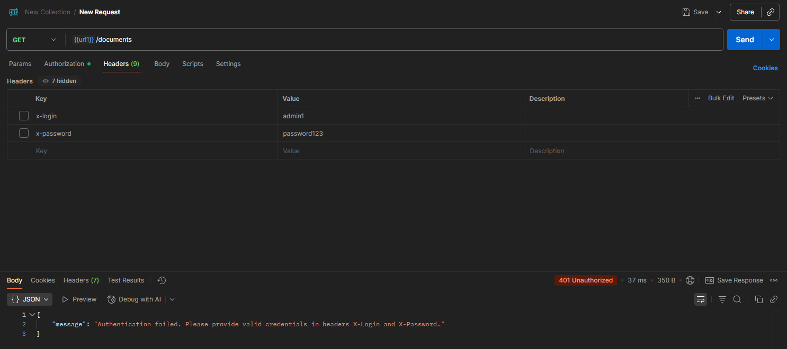
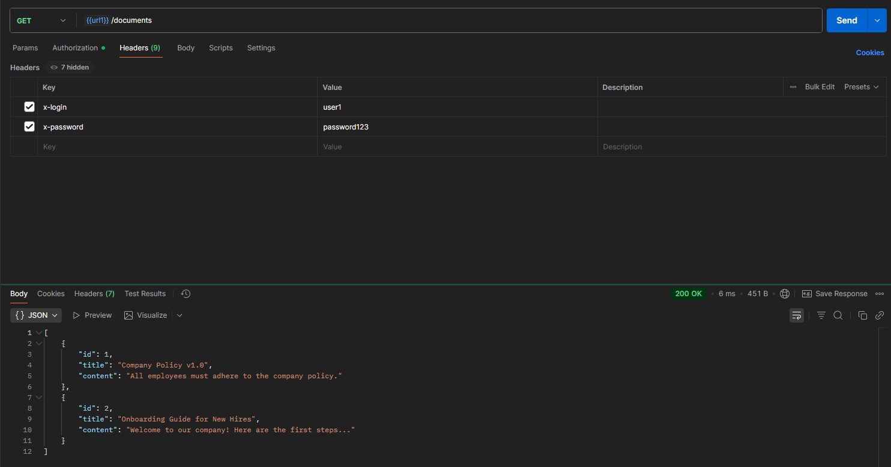
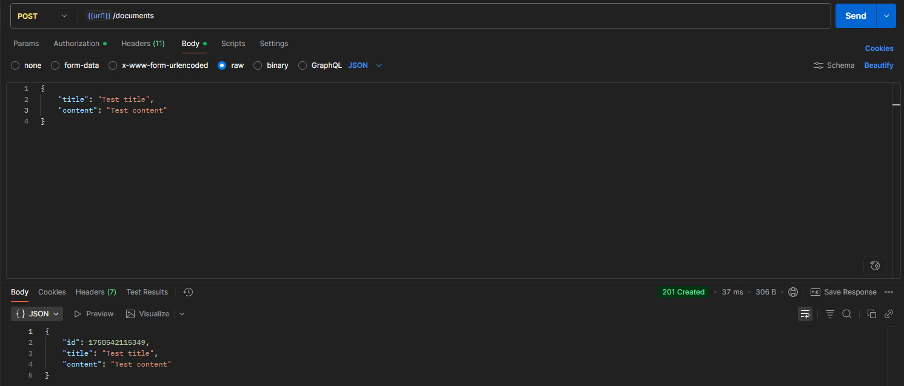
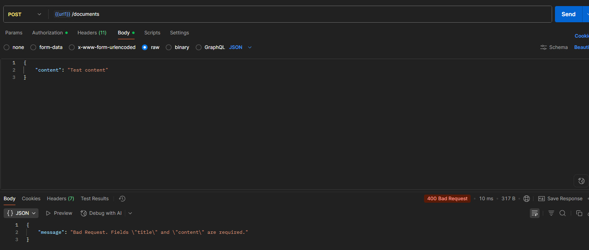
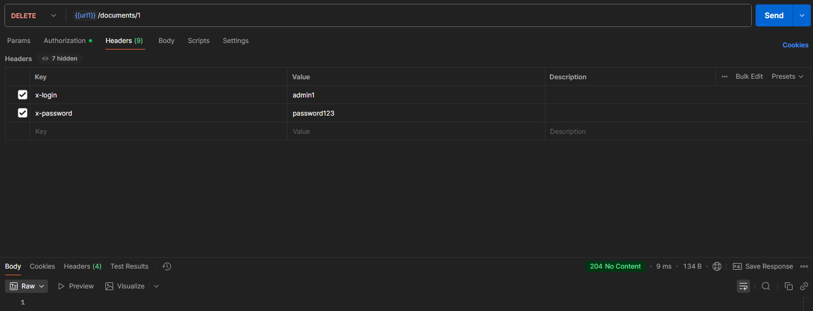
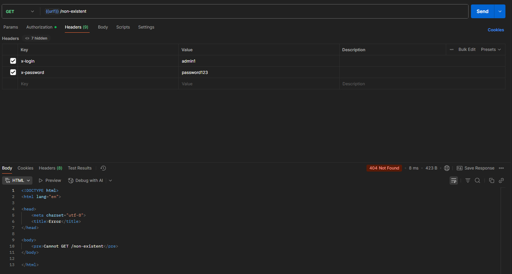
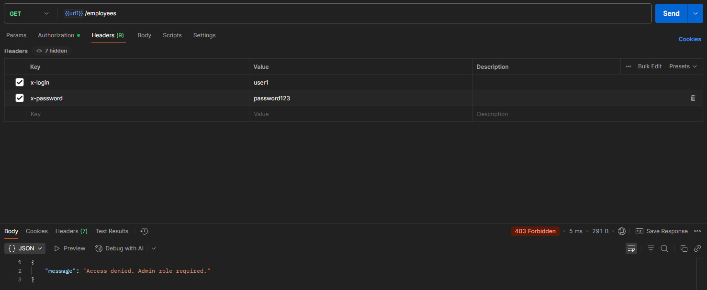
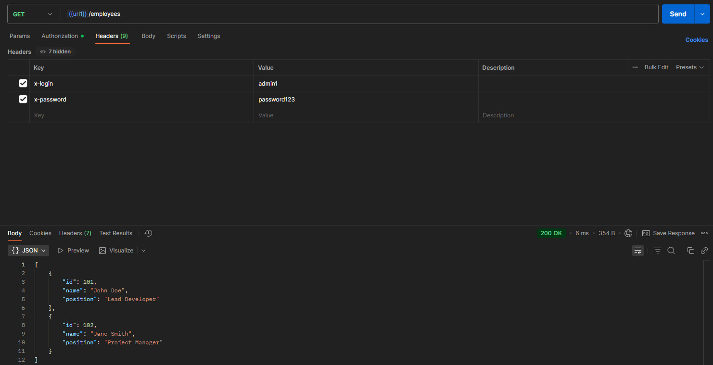

# software-design-workshop-3

## Опис проєкту

Цей проєкт є лабораторно-практичною роботою з розробки та тестування
захищеного REST API на **Node.js** та **Express**.\
Сервер реалізує роботу з ресурсами **документів** та **співробітників**,
передбачає аутентифікацію та авторизацію користувачів за ролями, а також
веде логування всіх запитів.\
Функціонал перевіряється як вручну (через **Postman**), так і програмно
(через скрипт `test-client.js`).

------------------------------------------------------------------------

## Встановлення та запуск

1.  Клонуйте репозиторій:

    ``` bash
    git clone https://github.com/Akella55505/software-design-workshop-3
    cd software-design-workshop-3
    ```

2.  Встановіть залежності:

    ``` bash
    npm install
    ```

3.  Запустіть сервер:

    ``` bash
    npm start
    ```

    Сервер буде доступний за адресою: <http://localhost:3000>

------------------------------------------------------------------------

## Тестування

### Запуск тестового клієнта

Для запуску автоматичних тестів:

``` bash
npm test
```

Скрипт `test-client.js` програмно звертається до ендпоінтів і
перевіряє: - доступ без авторизації (401 Unauthorized), - доступ
звичайного користувача (200 OK / 403 Forbidden), - доступ адміністратора
(200 OK), - створення документа (201 Created / 400 Bad Request), -
видалення документа (204 No Content), - звернення до неіснуючого
маршруту (404 Not Found).

### Перевірка через Postman

У репозиторії (у теці `docs/` або у README) надані скріншоти роботи в
**Postman**, які демонструють: - успішні запити користувачів та
адміністратора, - обробку помилок (401, 403, 404), - створення та
видалення ресурсів.

------------------------------------------------------------------------

## Ендпоінти API

| Метод  | URL              | Опис                                   | Заголовки (Headers)                  | Тіло запиту (Body)                     | Коди відповіді       |
|--------|------------------|----------------------------------------|--------------------------------------|----------------------------------------|----------------------|
| GET    | `/documents`     | Отримати список усіх документів        | `X-Login`, `X-Password`              | –                                      | 200 OK, 401 Unauthorized |
| POST   | `/documents`     | Створити новий документ                | `X-Login`, `X-Password`              | `{ "title": "...", "content": "..." }` | 201 Created, 400 Bad Request, 401 Unauthorized |
| DELETE | `/documents/:id` | Видалити документ за ID                | `X-Login`, `X-Password`              | –                                      | 204 No Content, 401 Unauthorized, 404 Not Found |
| GET    | `/employees`     | Отримати список співробітників (admin) | `X-Login`, `X-Password` (роль admin) | –                                      | 200 OK, 401 Unauthorized, 403 Forbidden |

------------------------------------------------------------------------

## Приклади використання

### Успішний GET-запит від користувача:

``` bash
curl -X GET http://localhost:3000/documents \
  -H "X-Login: user1" \
  -H "X-Password: password123"
```

### Успішний GET-запит від адміністратора:

``` bash
curl -X GET http://localhost:3000/employees \
  -H "X-Login: admin1" \
  -H "X-Password: password123"
```

### Невдалий POST-запит (відсутнє поле `title`):

``` bash
curl -X POST http://localhost:3000/documents \
  -H "Content-Type: application/json" \
  -H "X-Login: user1" \
  -H "X-Password: password123" \
  -d '{"content": "..." }'
```

------------------------------------------------------------------------

## Структура проєкту

    ├─ data.js          # модуль з даними (користувачі, документи, співробітники)
    ├─ server.js        # основний файл сервера
    ├─ test-client.js   # скрипт для програмного тестування API
    ├─ .gitignore       # ігнорування node_modules та службових файлів
    └─ package.json     # маніфест проєкту

------------------------------------------------------------------------

## Скріншоти виконання запитів у Postman










------------------------------------------------------------------------

## Посилання на репозиторій

[This repo](https://github.com/Akella55505/software-design-workshop-3)

------------------------------------------------------------------------
